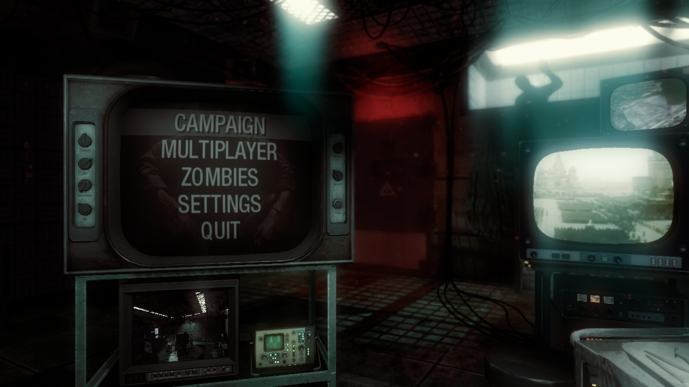
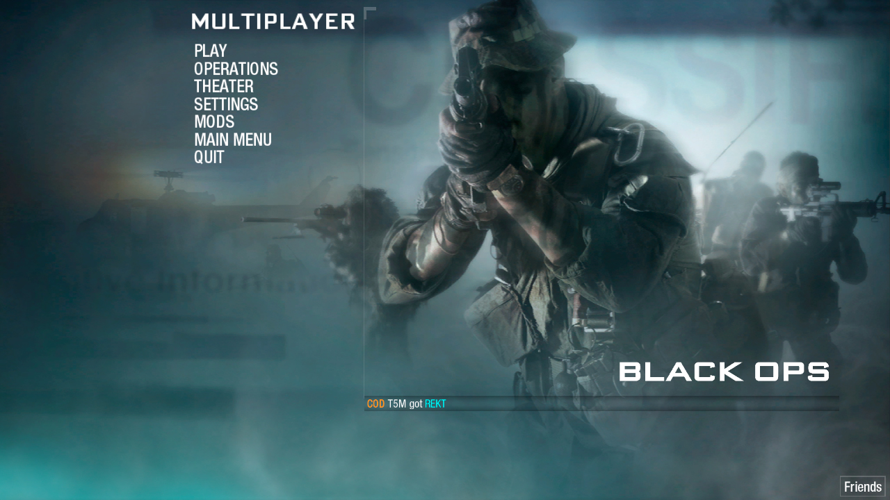
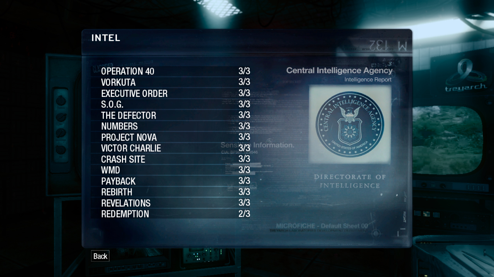
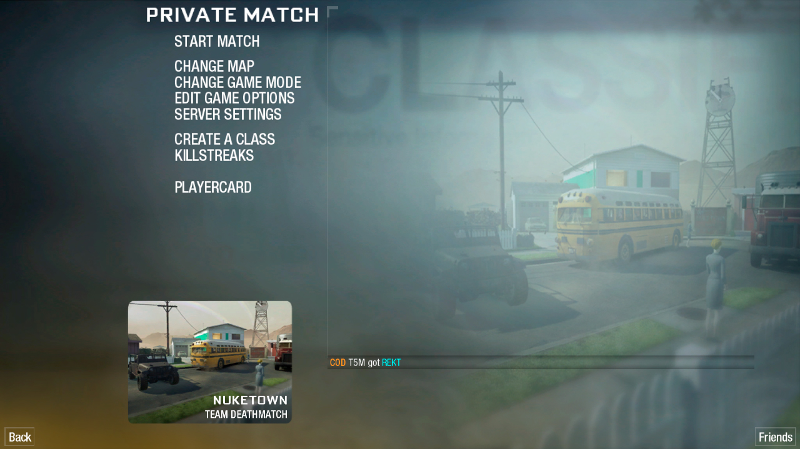
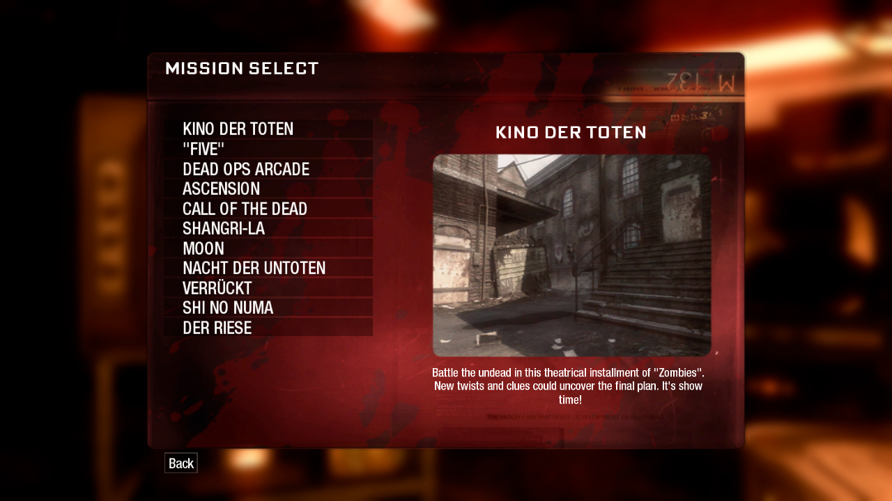
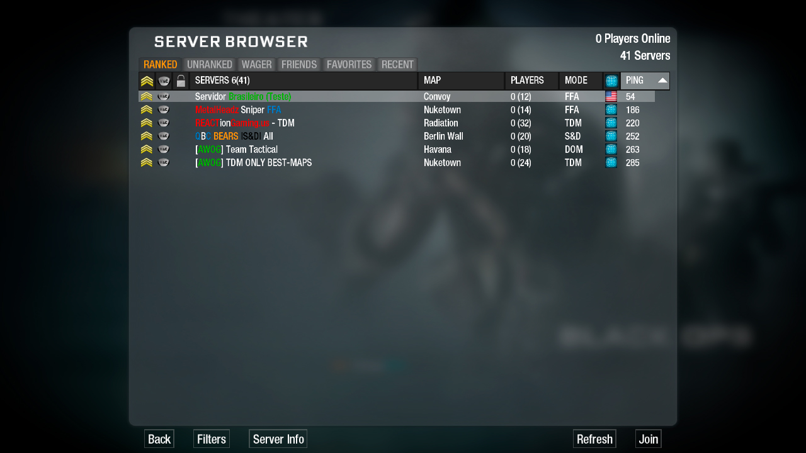
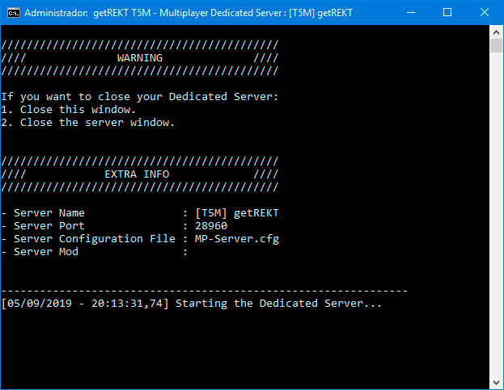
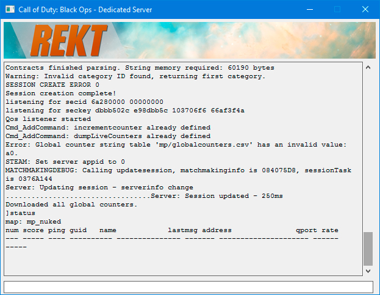

# getREKT (T5M)
 
- **T5M** es el proyecto de **getREKT** para poder jugar al **Call of Duty: Black Ops** (con el nombre en clave (oficial) de **T5**), en continuación del proyecto **T5M** de **FourDeltaOne** (4D1).

## Aviso
- Este repositorio no contiene ningún código de T5M, tan solo proporciona soporte y ayuda a los usuarios de habla hispana.
- **getREKT** no apoya la piratería, además de que no puedes usar copias de **Skidrow** / **nosTEAM** (necesitarás una copia del juego original, o una pirata con sus archivos actualizados).
- Si has estado en ~2014 (antes de que getREKT cierre), y has creado una cuenta, podrás usar esas mismas credenciales.
  * Si, necesitas crearte una cuenta en su sitio web para poder jugar (y por ahora, no tiene soporte para jugar Offline (si o si, se necesita Internet)).

## Tabla de Contenidos
- [Cliente](../../wiki/Cliente)
  - [Requisitos](../../wiki/Cliente#requisitos)
    - [Aviso](../../wiki/Cliente#aviso)
  - [Proceso de Instalación](../../wiki/Cliente#proceso-de-instalación)
  - [Colores](../../wiki/Cliente#colores)
  - [Crear una Partida](../../wiki/Cliente#crear-una-partida)
  - [Unirse a una partida](../../wiki/Cliente#unirse-a-una-partida)
- [Servidor](../../wiki/Servidor)
  - [Requisitos](../../wiki/Servidor#requisitos)
    - [Aviso](../../wiki/Servidor#aviso)
  - [Proceso de Instalación](../../wiki/Servidor#proceso-de-instalación)
  - [Configuración del Servidor Dedicado](../../wiki/Servidor#configuración-del-servidor-dedicado)
  - [Optimizar Servidor](../../wiki/Servidor#optimizar-servidor)
- [Preguntas Frecuentes](../../wiki/Preguntas-Frecuentes)
  - [¿Donde puedo descargar la última versión de T5M?](../../wiki/Preguntas-Frecuentes#donde-puedo-descargar-la-última-versión-de-t5m)
  - [¿Qué versiones del juego puedo usar?](../../wiki/Preguntas-Frecuentes#qué-versiones-del-juego-puedo-usar)
  - [¿Necesito los DLC para jugar?](../../wiki/Preguntas-Frecuentes#necesito-los-dlc-para-jugar)
  - [¿Qué idiomas puedo usar?](../../wiki/Preguntas-Frecuentes#qué-idiomas-puedo-usar)
  - [¿Puedo tener el juego de Steam y T5M en la misma carpeta?](../../wiki/Preguntas-Frecuentes#puedo-tener-el-juego-de-steam-y-t5m-en-la-misma-carpeta)
  - [¿Puedo tener VAC o Game Ban por usar T5M?](../../wiki/Preguntas-Frecuentes#puedo-tener-vac-o-game-ban-por-usar-t5m)
  - [¿Qué modos soporta T5M?](../../wiki/Preguntas-Frecuentes#qué-modos-soporta-t5m)
  - [¿Cómo puedo iniciar el Modo Multijugador?](../../wiki/Preguntas-Frecuentes#cómo-puedo-iniciar-el-modo-multijugador)
  - [¿Se puede jugar de forma Offline? ¿Y LAN?](../../wiki/Preguntas-Frecuentes#se-puede-jugar-de-forma-offline-y-lan)
  - [¿Debo abrir los puertos?](../../wiki/Preguntas-Frecuentes#debo-abrir-los-puertos)
  - [¿Cómo puedo abrir la consola?](../../wiki/Preguntas-Frecuentes#cómo-puedo-abrir-la-consola)
  - [¿Cómo puedo agregar amigos?](../../wiki/Preguntas-Frecuentes#cómo-puedo-agregar-amigos)
  - [¿Cómo puedo usar LinkerMod?](../../wiki/Preguntas-Frecuentes#cómo-puedo-usar-linkermod)
  - [¿Qué significan estos archivos de T5M?](../../wiki/Preguntas-Frecuentes#qué-significan-estos-archivos-de-t5m)
  - [¿Cómo puedo reparar/verificar mis archivos de juego?](../../wiki/Preguntas-Frecuentes#cómo-puedo-repararverificar-mis-archivos-de-juego)
  - [¿Cómo puedo reparar/verificar mis archivos de T5M?](../../wiki/Preguntas-Frecuentes#cómo-puedo-repararverificar-mis-archivos-de-t5m)
  - [¿Puedo tener Cliente y Servidor en la misma carpeta?](../../wiki/Preguntas-Frecuentes#puedo-tener-cliente-y-servidor-en-la-misma-carpeta)
  - [¿Cómo puedo desbloquear todo en el SP / ZM?](../../wiki/Preguntas-Frecuentes#cómo-puedo-desbloquear-todo-en-el-sp--zm)
  - [¿Cómo puedo desbloquear todo en el MP?](../../wiki/Preguntas-Frecuentes#cómo-puedo-desbloquear-todo-en-el-mp)
  - [He sido baneado del servidor de X ¿Cuál es su sitio web?](../../wiki/Preguntas-Frecuentes#he-sido-baneado-del-servidor-de-x-cuál-es-su-sitio-web)
- [Solución de problemas](../../wiki/Soluci%C3%B3n-de-problemas)
  - [An error (7) while checking the bootstrapper version.](../../wiki/Soluci%C3%B3n-de-problemas#an-error-7-while-checking-the-bootstrapper-version)
  - [The selected path does not contain a main\iw_00.iwd file.](../../wiki/Soluci%C3%B3n-de-problemas#the-selected-path-does-not-contain-a-mainiw_00iwd-file)
  - [Couldn't load library: binkw32.dll](../../wiki/Soluci%C3%B3n-de-problemas#couldnt-load-library-binkw32dll)
  - [You have specified an incorrect username / password.](../../wiki/Soluci%C3%B3n-de-problemas#you-have-specified-an-incorrect-username--password)
  - [EXE_CANNOT_FIND_ZONE](../../wiki/Soluci%C3%B3n-de-problemas#exe_cannot_find_zone)
  - [Could not load image](../../wiki/Soluci%C3%B3n-de-problemas#could-not-load-image)
  - [Deleting Old content.getrektby.us/t5m/t5game.dll.xz failed (error 5)](../../wiki/Soluci%C3%B3n-de-problemas#deleting-old-contentgetrektbyust5mt5gamedllxz-failed-error-5)
  - [IShellItem::GetDisplayName failed. HRESULT = 0x80070057](../../wiki/Soluci%C3%B3n-de-problemas#ishellitemgetdisplayname-failed-hresult--0x80070057)
  - [Inicio el juego y la pantalla se queda en negro](../../wiki/Soluci%C3%B3n-de-problemas#inicio-el-juego-y-la-pantalla-se-queda-en-negro)
  - [Me sale un error diciendo "No tienes este mapa" cuando realmente tengo el mapa!](../../wiki/Soluci%C3%B3n-de-problemas#me-sale-un-error-diciendo-no-tienes-este-mapa-cuando-realmente-tengo-el-mapa)
  - [El juego se crashea en el menú tras el mensaje: Obteniendo estadísticas / Fetching stats](../../wiki/Soluci%C3%B3n-de-problemas#el-juego-se-crashea-en-el-menú-tras-el-mensaje-obteniendo-estadísticas--fetching-stats)
  - [Inicio T5M y me sale: There is an important update available. (...)](../../wiki/Soluci%C3%B3n-de-problemas#inicio-t5m-y-me-sale-there-is-an-important-update-available-)
  - [Unable to open data/.keep for writing.](../../wiki/Soluci%C3%B3n-de-problemas#unable-to-open-datakeep-for-writing)
  - [Me sale un mensaje diciendo: Los servidores de CoD: BO no están disponibles y (...)](../../wiki/Soluci%C3%B3n-de-problemas#me-sale-un-mensaje-diciendo-los-servidores-de-cod-bo-no-están-disponibles-y-)
  - [Me sale un mensaje diciendo: Ha ocurrido un error al intentar conectar con el servidor](../../wiki/Soluci%C3%B3n-de-problemas#me-sale-un-mensaje-diciendo-ha-ocurrido-un-error-al-intentar-conectar-con-el-servidor)
  - [Me sale un mensaje diciendo: Conectando](../../wiki/Soluci%C3%B3n-de-problemas#me-sale-un-mensaje-diciendo-conectando)
  - [Me sale un mensaje diciendo: Descargando ajustes del juego...y no desaparece nunca!](../../wiki/Soluci%C3%B3n-de-problemas#me-sale-un-mensaje-diciendo-descargando-ajustes-del-juegoy-no-desaparece-nunca)
  - [Entro a un servidor y estoy como Espectador, no puedo elegir clases ni nada!](../../wiki/Soluci%C3%B3n-de-problemas#entro-a-un-servidor-y-estoy-como-espectador-no-puedo-elegir-clases-ni-nada)
  - [Mis FPS están bloqueados en 60 ¿cómo los aumento?](../../wiki/Soluci%C3%B3n-de-problemas#mis-fps-están-bloqueados-en-60-cómo-los-aumento)
  - [Quiero conectar a mi propio servidor y no puedo!](../../wiki/Soluci%C3%B3n-de-problemas#quiero-conectar-a-mi-propio-servidor-y-no-puedo)
- [Enlaces de getREKT](#enlaces-de-getrekt)
- [Enlaces importantes de CoD: BO](#enlaces-importantes-de-cod-bo)
- [Imágenes](#imágenes)

## Enlaces de getREKT
**[`^        VOLVER ARRIBA        ^`](#tabla-de-contenidos)**
- [Sitio Web](https://getrektby.us/) - Sitio web de getREKT.
- [Discord](https://discord.gg/HqjQFCp) - Servidor de getREKT en Discord.
- [Wiki](../../wiki) - Wiki no oficial (en español) de T5M, donde encontrarás (casi) todo lo que necesitas.

## Enlaces importantes de CoD: BO
**[`^        VOLVER ARRIBA        ^`](#tabla-de-contenidos)**
- [Manual](http://store.steampowered.com/manual/42700/)
- [Discusiones](https://steamcommunity.com/app/42700/discussions/) ([MP](https://steamcommunity.com/app/42710/discussions/))
- [Guías](https://steamcommunity.com/app/42700/guides/) ([MP](https://steamcommunity.com/app/42710/guides/))
- [PCGamingWiki](https://pcgamingwiki.com/wiki/Call_of_Duty:_Black_Ops)

## Imágenes
**[`^        VOLVER ARRIBA        ^`](#tabla-de-contenidos)**

|                                                     **Modo Zombis**                                                      |                                           **Modo Multijugador**                                            |
|:------------------------------------------------------------------------------------------------------------------------:|:----------------------------------------------------------------------------------------------------------:|
|    
    |    
    |
|    
    |    
    |
|    
    |    
    |
|                                          **Servidor Dedicado** (Modo Multijugador)                                          |                                **Servidor Dedicado** (Modo Multijugador)                                |
| 
 | 
 |
